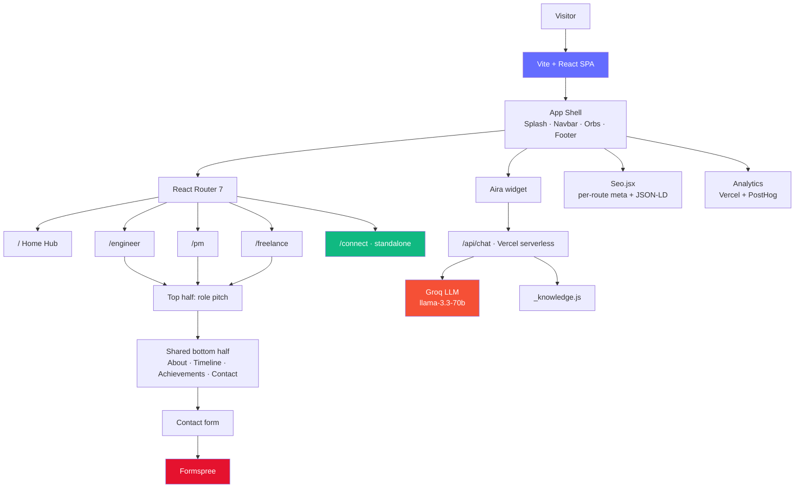

<div align="center">

# 🌐 ajinkyadhumal.com

### One portfolio, four audiences — an animated personal-brand platform for a Product-Minded Full Stack Engineer

[](https://vitejs.dev/)
[](https://react.dev/)
[](https://tailwindcss.com/)
[](https://gsap.com/)
[](https://www.framer.com/motion/)
[](https://ajinkyadhumal.com)

**[🚀 Live Site](https://ajinkyadhumal.com)** • [Routes](#-routes) • [Features](#-features) • [Architecture](#️-architecture) • [Quick Start](#-quick-start) • [Deployment](#-deployment)

</div>

---

## 📖 Overview

**ajinkyadhumal.com** is a single-page application that behaves like **four portfolios in one**. Instead of a generic "developer site," every visitor lands on a route tuned to *why they came* — a tech recruiter, a PM hiring manager, or a business client — and then scrolls into a shared, animated personal-brand foundation.

Each route page is built in **two halves**: a role-specific **pitch** up top (unique per audience) and a shared **personal-brand** section below (About, Education timeline, Achievements, Contact). One story, told four ways, without confusing any of them.

### Why this platform?

| Pillar | What it delivers |
|---|---|
| 🎯 **Audience-tuned routing** | `/engineer`, `/pm`, `/freelance` each open with a pitch built for that reader — shared as targeted links (recruiters get `/engineer`, clients get `/freelance`) |
| 🎬 **Real animation system** | GSAP + ScrollTrigger for the splash, scroll-driven timeline & parallax; Framer Motion for tilt/magnetic/page-transitions; Lottie for hero illustrations |
| 🤖 **"Aira" AI assistant** | A Groq-powered serverless chat that answers questions about Ajinkya's work — grounded in a hand-written knowledge base, with a graceful offline fallback |
| ⚡ **Fast by construction** | Per-route code-splitting, lazy-loaded Lottie, a `lowPerfMode` that strips heavy GPU effects on mobile, and CLS-free scroll layouts |
| 🔍 **SEO-first** | Static pre-render content, `Person` + `WebSite` JSON-LD, per-route meta/OG, sitemap, robots, and 301 redirects to the apex domain |
| 📇 **`/connect` tap page** | A standalone NFC/QR "digital business card" with one-tap save-contact (vCard), WhatsApp, and its own analytics |

---

## 🌐 Routes

🌐 **Production:** **[ajinkyadhumal.com](https://ajinkyadhumal.com)**

| Route | Opens with | For |
|-------|------------|-----|
| **[`/`](https://ajinkyadhumal.com)** | The hub — three route cards | Anyone (Google searchers) |
| **[`/engineer`](https://ajinkyadhumal.com/engineer)** | Full-stack pitch, projects, skills | Tech recruiters |
| **[`/pm`](https://ajinkyadhumal.com/pm)** | 16 product teardowns + case studies | PM hiring managers |
| **[`/freelance`](https://ajinkyadhumal.com/freelance)** | Client work, services, process | Business clients |
| **[`/connect`](https://ajinkyadhumal.com/connect)** | NFC/QR digital business card | In-person networking |

---

## 📑 Table of Contents

- [Routes](#-routes)
- [Features](#-features)
- [Tech Stack](#️-tech-stack)
- [Architecture](#️-architecture)
- [Quick Start](#-quick-start)
- [Environment Variables](#-environment-variables)
- [Project Structure](#-project-structure)
- [The Aira Assistant](#-the-aira-assistant)
- [SEO & Performance](#-seo--performance)
- [Deployment](#-deployment)
- [Roadmap](#️-roadmap)
- [Author](#-author)

---

## ✨ Features

<table>
<tr>
<td width="50%" valign="top">

### 🧭 Multi-Route Architecture
- 🏠 Home hub with three animated route cards
- 🧑‍💻 `/engineer` — projects, skills, live GitHub feed
- 📊 `/pm` — 16 case studies + product deliverables
- 💼 `/freelance` — client work, services, process
- 📇 `/connect` — standalone tap/QR business card
- ♻️ Shared "bottom half" reused across all routes

### 🎬 Animation & Motion
- ✨ GSAP master-timeline splash (dot → wireframe → name)
- 📜 Scroll-driven horizontal Education timeline (CLS-free)
- 🌀 Parallax orbs + scrubbed section reveals
- 🧲 Magnetic links & 3D tilt cards (Framer Motion)
- 🎞️ Lottie hero illustrations, lazy-loaded
- 🖱️ Desktop cursor follower + route transitions

### 🎨 Design System
- 🌑 Dark theme (`#050505`) with per-route accent colors
- 🎨 Accent driven by `data-route` → CSS variables
- 🪟 Glass-morphism panels, noise textures, gradient glows
- 🔤 Lucide + React Icons

</td>
<td width="50%" valign="top">

### 🤖 Aira — AI Assistant
- 💬 Floating chat widget on every route
- ⚡ Groq serverless function (`api/chat.js`)
- 📚 Answers grounded in `api/_knowledge.js`
- 🛟 Graceful fallback when the key is unset
- ⌨️ `⌘K` command palette for quick navigation

### 🔍 SEO & Discoverability
- 🧾 `Person` + `WebSite` JSON-LD graph
- 🏷️ Per-route title / description / OG / Twitter
- 🕷️ Static pre-render block + `<noscript>` fallback
- 🗺️ `sitemap.xml`, `robots.txt`, canonical to apex
- ↪️ 301 redirects (www + old domain → apex)

### ⚡ Performance
- 📦 Per-route lazy code-splitting
- 📉 `lowPerfMode` disables heavy GPU effects on mobile
- 🖼️ Optimized images, lazy Lottie
- 📐 Sticky-based layouts for zero layout shift

### 📊 Analytics & Forms
- 📈 Vercel Web Analytics (site-wide)
- 🔬 PostHog events on the `/connect` page
- 📬 Formspree AJAX contact form

</td>
</tr>
</table>

---

## 🛠️ Tech Stack

### Core


### Motion & Illustration


### Backend & Services


<details>
<summary>🔍 Complete dependency breakdown</summary>

### Runtime dependencies
| Package | Version | Purpose |
|---------|---------|---------|
| `react` / `react-dom` | 19.1 | UI library |
| `react-router-dom` | 7.6 | Client-side routing (SPA) |
| `gsap` | 3.13 | Scroll-driven animation + splash timeline |
| `@gsap/react` | 2.1 | (GSAP React helpers — see note below) |
| `framer-motion` | 12.23 | Component interactions, tilt, page transitions |
| `lottie-react` | 2.4 | Lottie renderer |
| `@lottiefiles/dotlottie-react` | 0.18 | dotLottie renderer (smaller assets) |
| `split-type` | 0.3 | Text-splitting for headline reveals |
| `lucide-react` | 0.542 | Icon set |
| `react-icons` | 5.5 | Brand/tech icons |
| `react-intersection-observer` | 9.16 | In-view reveal triggers |
| `@vercel/analytics` | 2.0 | Web analytics |
| `posthog-js` | 1.396 | Product analytics (`/connect`) |

### Dev / build
| Package | Version | Purpose |
|---------|---------|---------|
| `vite` | 7.0 | Build tool + dev server |
| `@vitejs/plugin-react` | 4.6 | React fast-refresh |
| `tailwindcss` | 3.4 | Utility-first styling |
| `postcss` / `autoprefixer` | 8.5 / 10.4 | CSS processing |
| `qrcode` | 1.5 | Build-time tool that generated the committed `/connect` QR image (not imported at runtime) |

> **⚙️ GSAP note:** `@gsap/react`'s `useGSAP` hook is incompatible with React 19 + Vite (throws *"Invalid hook call"*), so the project uses a **custom `useGSAP`** in `src/lib/gsap.js` built on `useLayoutEffect` + `gsap.context`. All GSAP work imports from `src/lib/gsap.js`.

</details>

---

## 🏗️ Architecture



### Conventions & patterns

| Pattern | Where | Why |
|---------|-------|-----|
| **Two-halves pages** | `pages/*Page.jsx` | Role-specific pitch + shared brand sections (`SharedBottom.jsx`) |
| **Per-route accent** | `data-route` attr → CSS vars in `index.css` | One theme, four accent colors without prop-drilling |
| **Custom `useGSAP`** | `lib/gsap.js` | React 19 / Vite-safe GSAP context (avoids `@gsap/react` bug) |
| **Perf gating** | `lib/perf.js` | `prefersReducedMotion` · `detectLowPerf` · `isDesktopPointer`/`useIsDesktop` |
| **Code-split routes** | `App.jsx` (`lazy()`) | Each page ships as its own chunk |
| **Sticky scroll (not GSAP pin)** | `EducationTimeline.jsx` | Horizontal scroll with **zero CLS** on mobile |
| **Standalone route** | `/connect` short-circuits the Shell | Opens instantly, no splash/navbar/footer |

---

## 🚀 Quick Start

### Prerequisites
- **Node.js** 20+ and **npm** (Vite 7 requires Node 20.19+ / 22.12+)
- **Git**

### 1️⃣ Clone & install

```bash
git clone https://github.com/Ajinkyaa2004/Ajinkya-Dhumal.com.git
cd Ajinkya-Dhumal.com                # repo folder is Ajinkya-Dhumal.com; the domain is ajinkyadhumal.com
npm install
cp .env.example .env.local           # optional — add GROQ_API_KEY to enable the AI assistant
```

### 2️⃣ Run the dev server

```bash
npm run dev
```

Open **[http://localhost:5173](http://localhost:5173)**.

### Available scripts

```bash
npm run dev        # Start Vite dev server (HMR) — also serves /api/chat locally
npm run build      # Production build → dist/
npm run preview    # Preview the production build locally
```

---

## 🔑 Environment Variables

Everything runs without env vars (the AI assistant simply shows a graceful fallback). To enable the full experience, copy the template (`cp .env.example .env.local`) and fill it in. The shipped `.env.example` includes only `GROQ_API_KEY`; the PostHog vars below are optional extras:

```bash
# Aira AI assistant — Groq (server-side, used by api/chat.js)
GROQ_API_KEY=your_groq_api_key

# PostHog analytics for /connect (client-side, optional)
VITE_POSTHOG_KEY=your_posthog_project_key
VITE_POSTHOG_HOST=https://us.i.posthog.com
```

| Variable | Scope | Required? | Purpose |
|----------|-------|-----------|---------|
| `GROQ_API_KEY` | Server | Optional | Powers the Aira chat; without it, the widget shows a friendly fallback |
| `VITE_POSTHOG_KEY` | Client | Optional | PostHog events on the `/connect` page |
| `VITE_POSTHOG_HOST` | Client | Optional | PostHog host (defaults to US cloud) |

> 📬 The contact form posts to a **Formspree** endpoint configured in `src/data/shared-data.js` (`CONTACT.formspree`) — no env var needed.

---

## 📁 Project Structure

```
ajinkyadhumal.com/
│
├── api/                          # Vercel serverless functions
│   ├── chat.js                   # Aira assistant → Groq (llama-3.3-70b)
│   └── _knowledge.js             # Hand-written knowledge base for Aira
│
├── public/                       # Static assets
│   ├── ajinkya-dhumal.jpg        # Headshot (SEO + /connect avatar)
│   ├── ajinkya-dhumal.vcf        # vCard for one-tap save-contact
│   ├── connect-qr.png            # QR code for the tap page
│   ├── og-{home,engineer,pm,freelance}.png   # Per-route OG images
│   ├── resume-engineer.pdf       # Downloadable résumés
│   ├── resume-pm.pdf
│   ├── sitemap.xml · robots.txt · manifest.json
│
├── src/
│   ├── main.jsx                  # Vite entry
│   ├── App.jsx                   # Shell: splash → router → navbar → footer
│   │
│   ├── pages/                    # One file per route
│   │   ├── HomePage.jsx
│   │   ├── EngineerPage.jsx
│   │   ├── PMPage.jsx
│   │   ├── FreelancePage.jsx
│   │   ├── ConnectPage.jsx       # Standalone tap page
│   │   └── NotFound.jsx
│   │
│   ├── components/
│   │   ├── shared/               # Navbar, Footer, SplashScreen, Aira,
│   │   │                         #   CommandPalette, EducationTimeline,
│   │   │                         #   AboutSection, ContactSection, Seo, …
│   │   ├── home/                 # HeroHub
│   │   ├── engineer/             # Hero, ProjectsGallery, SkillsGrid,
│   │   │                         #   StatsMarquee, CurrentRoles, GitHubActivity
│   │   ├── pm/                   # PMHero, CaseStudyGrid, TeardownBook,
│   │   │                         #   PMAnalyticsPanel, BeThePM, WhyPM, …
│   │   └── freelance/            # Hero, ClientWork, ServicesGrid,
│   │                             #   ProcessStrip, WhyWorkWithMe, …
│   │
│   ├── data/                     # Content, decoupled from components
│   │   ├── engineer-data.js      # Projects, skills, stats
│   │   ├── pm-data.js            # 16 case studies, PM skills
│   │   ├── freelance-data.js     # Client work, services
│   │   └── shared-data.js        # Contact, education, achievements
│   │
│   ├── lib/
│   │   ├── gsap.js               # Custom React-19-safe useGSAP + ScrollTrigger
│   │   ├── perf.js               # Reduced-motion / low-perf / desktop detection
│   │   └── analytics.js          # Vercel + PostHog wiring
│   │
│   ├── styles/index.css          # Global styles, keyframes, accent CSS vars
│   └── lottie/                   # Hero + loading animations (.json)
│
├── index.html                    # SEO head + JSON-LD + pre-render block
├── vercel.json                   # Redirects · SPA rewrites · security headers
├── vite.config.js · tailwind.config.js · postcss.config.js
└── package.json
```

---

## 🤖 The Aira Assistant

**Aira** is a floating chat widget that answers visitor questions about Ajinkya's engineering, product, and freelance work.

- **Endpoint:** `POST /api/chat` (Vercel serverless, `api/chat.js`)
- **Model:** Groq **`llama-3.3-70b-versatile`** (OpenAI-compatible API)
- **Grounding:** the system prompt is built from `api/_knowledge.js`, a hand-written knowledge base kept in sync with `src/data/*`
- **Resilience:** if `GROQ_API_KEY` is unset or the call fails, the endpoint returns a friendly fallback pointing to email / LinkedIn / the route pages — so the widget **never looks broken**
- **Local dev:** `npm run dev` serves `POST /api/chat` through a Vite middleware, so setting `GROQ_API_KEY` in `.env.local` runs Aira on `localhost` — no deploy needed

```jsonc
// POST /api/chat
{ "messages": [{ "role": "user", "content": "What has Ajinkya built?" }] }
// → { "reply": "…grounded answer…" }
```

> Update `api/_knowledge.js` whenever the content in `src/data/*` changes so Aira stays accurate.

---

## 🔍 SEO & Performance

| Area | Implementation |
|------|----------------|
| **Structured data** | `Person` + `WebSite` JSON-LD `@graph` in `index.html`; per-route `ItemList` (Engineer, PM) and `ProfessionalService` (Freelance) injected via `Seo.jsx` |
| **Crawlability** | Static `#pre-render-content` block + `<noscript>` fallback give crawlers text before React mounts |
| **Meta** | Per-route `<title>`, description, canonical, OG & Twitter cards (`Seo.jsx`) |
| **Sitemaps** | `public/sitemap.xml` (routes + project pages) and `robots.txt` |
| **Domain** | Canonical to `ajinkyadhumal.com`; `www` and the old Vercel URL **301** to the apex (`vercel.json`) |
| **Speed** | Per-route code-splitting, lazy Lottie, `lowPerfMode` on mobile, sticky (not pinned) scroll layouts for **CLS ≈ 0** |
| **Security headers** | `X-Frame-Options`, `X-Content-Type-Options`, `Referrer-Policy`, `HSTS`, `Permissions-Policy` (`vercel.json`) |

---

## 🚀 Deployment

Deployed on **Vercel** with the apex domain **ajinkyadhumal.com**.

### Steps
1. Push to GitHub → Vercel auto-builds (`vite build` → `dist/`)
2. Add environment variables (`GROQ_API_KEY`, `VITE_POSTHOG_*`) in **Project → Settings → Environment Variables**
3. Vercel serves `dist/` + runs `api/*` as serverless functions

### `vercel.json` handles
- **Redirects:** `www.ajinkyadhumal.com` and `itsajinkya.vercel.app` → `https://ajinkyadhumal.com` (301, root + all paths)
- **Rewrites:** SPA fallback — everything except `/api/*` serves `index.html`
- **Headers:** security headers on every response

```bash
# Manual production deploy (from local)
npx vercel --prod
```

---

## 🗺️ Roadmap

- [x] Multi-route architecture with per-audience pitches
- [x] GSAP splash + scroll-driven animation system
- [x] 16 PM case-study teardowns
- [x] Aira AI assistant (Groq) with graceful fallback
- [x] Full SEO (JSON-LD, sitemap, 301s) + custom domain
- [x] `/connect` NFC/QR tap page with vCard + analytics
- [ ] Blog / writing section
- [ ] Case-study detail pages for engineering projects
- [ ] Light-theme variant
- [ ] i18n (English / Hindi)

---

## 👤 Author

**Ajinkya Dhumal** — Product-Minded Full Stack Engineer

<p align="left">
  <a href="https://ajinkyadhumal.com"></a>
  <a href="https://www.linkedin.com/in/ajinkya-dhumal/"></a>
  <a href="https://github.com/Ajinkyaa2004"></a>
  <a href="mailto:dhumalajinkya2004@gmail.com"></a>
</p>

---

<div align="center">

### 🌟 Show your support

If this project inspired you or you learned something from the code, consider giving it a ⭐

*This is a personal portfolio. The **code** is here to learn from and fork for your own site; the **content** — copy, case studies, images, and résumés — is © Ajinkya Dhumal.*

**Made by [Ajinkya Dhumal](https://ajinkyadhumal.com)** • [⬆ Back to top](#-ajinkyadhumalcom)

</div>
